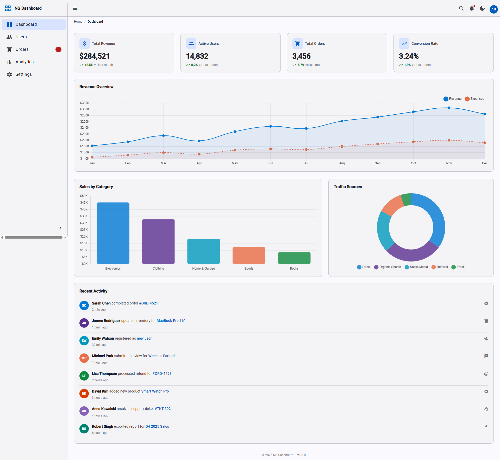
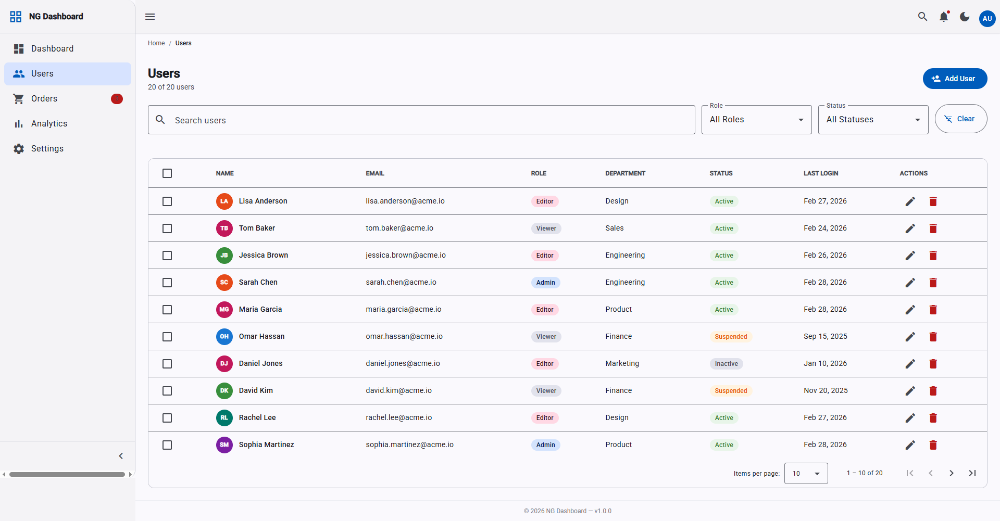
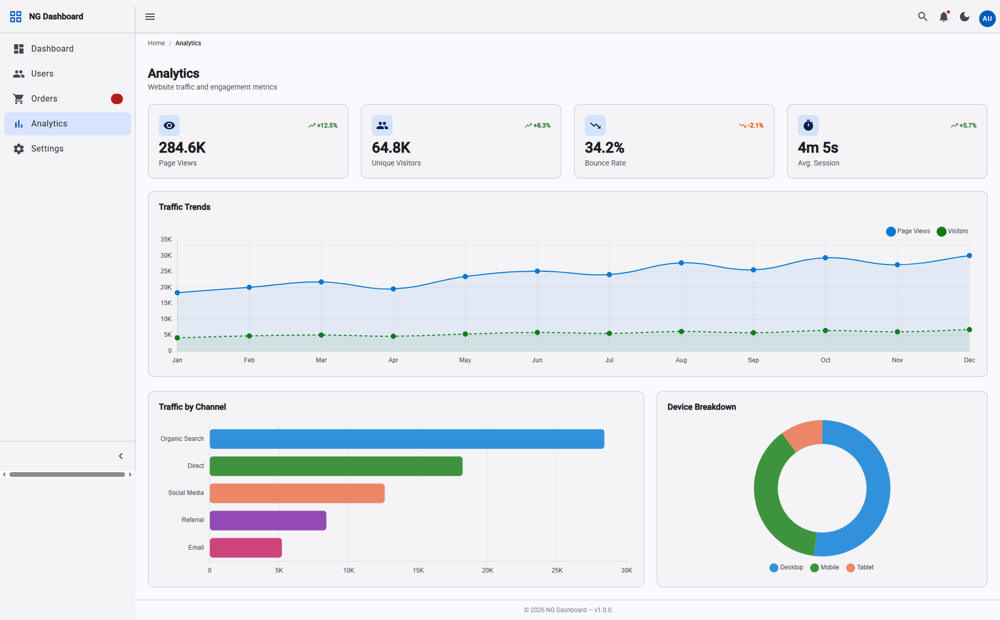
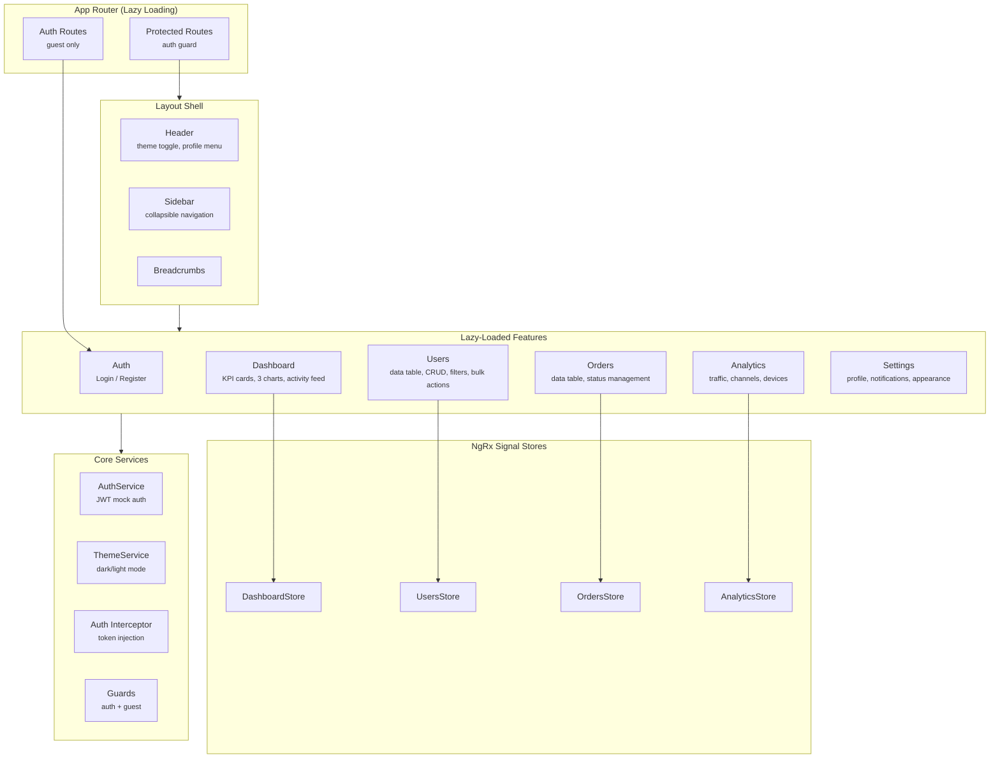

# Angular Enterprise Dashboard

> A production-grade admin dashboard built with Angular 18, NgRx Signal Store, and Material Design 3 — featuring real-time KPI metrics, interactive charts, user management with CRUD operations, and a fully responsive dark/light theme system.

[](https://angular.dev)
[](https://www.typescriptlang.org/)
[](https://ngrx.io/guide/signals)
[](https://material.angular.io/)
[](.)
[](LICENSE)

<!-- [Live Demo](https://angular-dashboard.vercel.app) -->

## Screenshots

| Dashboard | User Management |
|-----------|----------------|
|  |  |

| Analytics | Settings (Dark Mode) |
|-----------|---------------------|
|  |  |

> Screenshots coming after deployment. Run locally to preview.

## Tech Stack

| Category | Technology |
|----------|------------|
| **Framework** | Angular 18.2 with Signals & Standalone Components |
| **State Management** | NgRx Signal Store with computed selectors |
| **UI Library** | Angular Material with Material Design 3 theming |
| **Charts** | Chart.js via ng2-charts (line, bar, doughnut) |
| **Forms** | Reactive Forms with custom validators |
| **Styling** | SCSS with M3 CSS custom properties |
| **Testing** | Jest with 95%+ coverage |
| **Package Manager** | PNPM |

## Architecture



## Features

- **Authentication** — Login/register with JWT mock flow, route guards, HTTP interceptor, demo credentials
- **Dashboard** — 4 KPI cards with trend indicators, revenue line chart, category bar chart, distribution doughnut chart, recent activity feed
- **User Management** — Sortable/paginated data table, search with debounce, role/status filters, create/edit/delete dialogs, bulk selection
- **Orders** — Order tracking table with status management, filtering, pagination, and revenue totals
- **Analytics** — Traffic trends, channel breakdown (horizontal bar), device distribution, session KPIs with formatted values
- **Settings** — Profile form with validation, notification preferences, appearance/theme toggle
- **Theming** — Material Design 3 light/dark mode with CSS custom properties, system preference detection, localStorage persistence
- **Responsive Layout** — Collapsible sidebar, mobile-friendly hamburger menu, adaptive grid layouts

## Getting Started

### Prerequisites

- Node.js 20+ (via [NVM](https://github.com/nvm-sh/nvm))
- PNPM 9+ (`npm install -g pnpm`)

### Installation

```bash
git clone https://github.com/jayampathiw/angular-dashboard.git
cd angular-dashboard
pnpm install
```

### Development

```bash
pnpm start          # Dev server at http://localhost:4200
pnpm test           # Run unit tests
pnpm test:watch     # Run tests in watch mode
pnpm test:coverage  # Coverage report
pnpm build          # Production build
```

### Demo Credentials

| Field | Value |
|-------|-------|
| Email | `admin@demo.com` |
| Password | `password` |

## Testing

```bash
pnpm test              # 363 tests across 42 suites
pnpm test:coverage     # Full coverage report
```

| Metric | Coverage |
|--------|----------|
| Statements | 95.91% |
| Branches | 84.54% |
| Functions | 93.06% |
| Lines | 95.84% |

All NgRx Signal Stores, services, guards, interceptors, resolvers, and components are covered.

## Project Structure

```
src/app/
├── core/                           # Singletons — instantiated once
│   ├── auth/                       # AuthService, auth guard, interceptor
│   ├── models/                     # TypeScript interfaces (User, Auth, Nav)
│   └── services/                   # ThemeService, SidebarService, BreadcrumbService
│
├── features/                       # Lazy-loaded feature routes
│   ├── auth/                       # Login & Register pages
│   ├── dashboard/                  # KPI cards, charts, activity feed
│   │   ├── components/             # KpiCard, RevenueChart, CategoryChart, etc.
│   │   ├── store/                  # DashboardStore (NgRx Signal Store)
│   │   └── data/                   # Mock data
│   ├── users/                      # User management with CRUD
│   │   ├── components/             # UserTable, UserFilters, UserDialog
│   │   └── store/                  # UsersStore (pagination, sorting, filtering)
│   ├── orders/                     # Order tracking
│   ├── analytics/                  # Traffic, channels, devices
│   └── settings/                   # Profile, notifications, appearance
│
└── shared/                         # Reusable across features
    └── components/                 # Layout, Header, Sidebar, Footer, Breadcrumbs
```

## Key Patterns Demonstrated

- **Signals & Computed State** — All local component state uses `signal()` and `computed()` for fine-grained reactivity without RxJS overhead
- **NgRx Signal Store** — Feature-level stores with `signalStore()`, `withState()`, `withComputed()`, `withMethods()`, and `patchState()` for immutable updates
- **Standalone Components** — Zero NgModules — every component declares its own imports
- **OnPush Change Detection** — Every component uses `ChangeDetectionStrategy.OnPush` for optimal performance
- **Functional Guards & Resolvers** — `CanActivateFn` and `ResolveFn<T>` — no class-based guards
- **Functional HTTP Interceptor** — `HttpInterceptorFn` for token injection
- **Signal Inputs/Outputs** — `input()`, `input.required()`, `output()` — no decorators
- **New Control Flow** — `@if`, `@for`, `@switch` — no legacy structural directives
- **Lazy Loading** — Route-level code splitting via `loadComponent()` and `loadChildren()`
- **inject() Function** — All dependencies injected via `inject()` — no constructor injection

## License

MIT

## Author

**Jayampathy Wijesena** — Senior Angular Developer

[](https://jayampathiw.github.io/Portfolio)
[](https://linkedin.com/in/jayampathy-wijesena)
[](https://github.com/jayampathiw)
